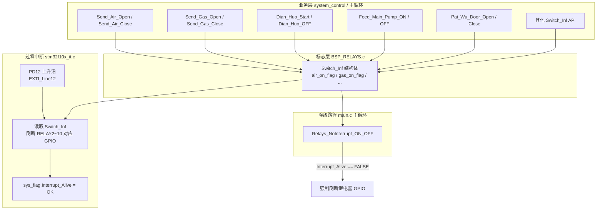

# PD12 外部中断 — 继电器过零刷新逻辑

> 固件：MCGS 三拼/五拼 V2.1.0（`Soft_Version = 210`）  
> 文档日期：2026-07-02

## 1. 概述

本程序采用 **交流过零检测 + 外部中断** 方式驱动大功率继电器，避免在 AC 电压峰值时吸合/释放，减小触点电弧与 EMI。

- **过零检测输入**：`GPIOD Pin 12`（PD12）
- **中断线**：`EXTI_Line12` → `EXTI15_10_IRQHandler`
- **触发方式**：上升沿（`EXTI_Trigger_Rising`）
- **刷新策略**：每次过零中断到来时，根据 `Switch_Inf` 中的逻辑标志位，同步刷新各继电器 GPIO 输出

业务层 **不直接操作** 大部分继电器引脚，而是通过 `BSP_RELAYS.c` 中的 API 设置 `Switch_Inf` 标志；实际 GPIO 翻转在过零中断或降级路径中完成。

---

## 2. 硬件与引脚

### 2.1 过零检测（PD12）

| 项目 | 配置 |
|------|------|
| 端口 | GPIOD |
| 引脚 | Pin 12 |
| 模式 | 输入上拉 `GPIO_Mode_IPU` |
| AFIO 映射 | `GPIO_EXTILineConfig(GPIOD, PinSource12)` |
| EXTI 线 | `EXTI_Line12` |
| NVIC 通道 | `EXTI15_10_IRQn` |
| 抢占/子优先级 | 2 / 2 |

初始化函数：`HARDWARE/led/bsp_led.c` → `IO_Interrupt_Config()`  
在 `USER/main.c` 中于 `RELAYS_GPIO_Config()` 之前调用。

### 2.2 过零中断驱动的继电器映射

以下继电器在 `EXTI15_10_IRQHandler` 的 `EXTI_Line12` 分支中刷新：

| 逻辑标志 (`Switch_Inf`) | 继电器宏 | GPIO | 功能说明 |
|-------------------------|----------|------|----------|
| `air_on_flag` | RELAY6 | PD15 | 送风电机 / 风机电源 |
| `gas_on_flag` | RELAY7 | PC6 | 燃气阀组 |
| `dian_huo_flag` | RELAY8 | PC7 | 点火继电器 |
| `water_switch_flag` | RELAY5 | PD14 | 补水泵 |
| `Water_Valve_Flag` | RELAY4 | PA8 | 补水电磁阀 |
| `pai_wu_flag` | RELAY9 | PC8 | 自动排污阀 |
| `MingHuo_Flag` | RELAY2 | PD3 | 明火阀 |
| `LianXu_PaiWu_flag` | RELAY10 | PC9 | 连续排污阀 |

> **不在过零路径中的继电器**
>
> | 继电器 | GPIO | 控制方式 |
> |--------|------|----------|
> | RELAY1 | PD2 | `Alarm_Out_Function()` 直接写 GPIO（报警输出） |
> | RELAY3 | PD1 | `ZongKong_YanFa_*` / `Solo_Work_ZhiShiDeng_*` 直接写 GPIO（联控烟阀 / 单机指示灯） |

GPIO 宏定义见 `HARDWARE/relays/bsp_relays.h`；继电器有效电平：`ON=0`（低电平吸合），`OFF=1`（高电平释放）。

---

## 3. 软件架构



---

## 4. 初始化流程

`USER/main.c` 启动顺序（节选）：

```c
LED_GPIO_Config();
IO_Interrupt_Config();   // PD12 过零 EXTI 配置
RELAYS_GPIO_Config();    // 继电器 GPIO 推挽输出初始化
```

`IO_Interrupt_Config()` 关键步骤（`bsp_led.c`）：

1. 使能 GPIOD、AFIO 时钟  
2. PD12 配置为输入上拉  
3. 映射 PD12 → EXTI12，上升沿中断  
4. 使能 `EXTI15_10_IRQn`

同函数内还配置了 **PB0** 的 EXTI0（风机 PWM 测速），与 PD12 过零逻辑独立。

---

## 5. 过零中断服务程序

文件：`USER/stm32f10x_it.c`  
函数：`EXTI15_10_IRQHandler()` → `EXTI_Line12` 分支

### 5.1 执行步骤

1. **标记过零中断存活**  
   `sys_flag.Interrupt_Alive = OK`  
   供主循环判断过零检测是否正常工作。

2. **复位风机延时计数器**（预留逻辑，见 §7）  
   `Switch_Inf.OpenWait_7ms = 0`  
   `Switch_Inf.CloseWait_3ms = 0`

3. **按标志刷新继电器**（每个标志独立 if/else）  
   - 标志为真 → 对应 `RELAYx_ON`  
   - 标志为假 → 对应 `RELAYx_OFF`

4. **清除中断挂起位**  
   `EXTI_ClearITPendingBit(EXTI_Line12)`

### 5.2 核心代码结构

```c
if (EXTI_GetITStatus(EXTI_Line12) != RESET)
{
    sys_flag.Interrupt_Alive = OK;

    Switch_Inf.OpenWait_7ms = 0;
    Switch_Inf.CloseWait_3ms = 0;

    if (Switch_Inf.air_on_flag)       RELAY6_ON;  else RELAY6_OFF;
    if (Switch_Inf.gas_on_flag)       RELAY7_ON;  else RELAY7_OFF;
    if (Switch_Inf.dian_huo_flag)     RELAY8_ON;  else RELAY8_OFF;
    if (Switch_Inf.water_switch_flag) RELAY5_ON;  else RELAY5_OFF;
    if (Switch_Inf.Water_Valve_Flag)  RELAY4_ON;  else RELAY4_OFF;
    if (Switch_Inf.pai_wu_flag)       RELAY9_ON;  else RELAY9_OFF;
    if (Switch_Inf.MingHuo_Flag)      RELAY2_ON;  else RELAY2_OFF;
    if (Switch_Inf.LianXu_PaiWu_flag)  RELAY10_ON; else RELAY10_OFF;

    EXTI_ClearITPendingBit(EXTI_Line12);
}
```

---

## 6. 标志位设置 API（业务 → Switch_Inf）

文件：`HARDWARE/relays/BSP_RELAYS.c`

| API | 设置的标志 | 典型用途 |
|-----|-----------|----------|
| `Send_Air_Open()` / `Send_Air_Close()` | `air_on_flag` | 风机启停（关闭时同时 `PWM_Adjust(0)`） |
| `Send_Gas_Open()` / `Send_Gas_Close()` | `gas_on_flag` | 燃气阀组 |
| `Dian_Huo_Start()` / `Dian_Huo_OFF()` | `dian_huo_flag` | 点火继电器 |
| `Feed_Main_Pump_ON()` / `Feed_Main_Pump_OFF()` | `water_switch_flag` | 补水泵 |
| `Second_Water_Valve_Open()` / `Close()` | `Water_Valve_Flag` | 补水电磁阀 |
| `Pai_Wu_Door_Open()` / `Close()` | `pai_wu_flag` | 自动排污 |
| `WTS_Gas_One_Open()` / `Close()` | `MingHuo_Flag` | 明火阀 |
| `LianXu_Paiwu_Open()` / `Close()` | `LianXu_PaiWu_flag` | 连续排污 |

全局实例：`SWITCH_STATUS Switch_Inf`（定义于 `BSP_RELAYS.c`，声明于 `bsp_relays.h`）。

---

## 7. 风机延时字段（预留 / 未完整实现）

`Switch_Inf` 中有两个计数器：

| 字段 | 注释含义 | 当前行为 |
|------|----------|----------|
| `OpenWait_7ms` | 风机开启延迟 7 ms | 每次过零中断清零；**全工程无递增代码** |
| `CloseWait_3ms` | 风机关闭延迟 3 ms | 同上 |

中断内存在空判断分支：

```c
if (Switch_Inf.air_on_flag) {
    if (Switch_Inf.OpenWait_7ms >= 7) { /* 空 */ }
    RELAY6_ON;
} else {
    if (Switch_Inf.CloseWait_3ms >= 3) { /* 空 */ }
    RELAY6_OFF;
}
```

由于计数器从未递增，条件恒为假，**风机继电器实际上每次过零都会立即刷新**，延时逻辑尚未生效。若需实现开/关延迟，应在 1 ms 定时器（如 TIM4）中递增计数，并在条件满足后再操作 RELAY6。

---

## 8. 降级路径：无过零中断时的强制刷新

当过零检测硬件异常或未接线时，`Interrupt_Alive` 保持 `FALSE`，主循环通过降级函数保证继电器仍能跟随逻辑标志：

- **函数**：`Relays_NoInterrupt_ON_OFF()`（`BSP_RELAYS.c`）
- **调用位置**：`USER/main.c` 主循环，注释为「继电器需要过零控制，检测不到中断，需要强制处理」
- **条件**：仅当 `sys_flag.Interrupt_Alive == FALSE` 时，按与过零中断相同的映射关系直接写 GPIO

> 一旦 PD12 过零中断正常触发，`Interrupt_Alive` 被置 `OK`，降级路径不再执行，继电器完全由过零中断刷新。

---

## 9. 与其他模块的关系

| 模块 | 关系 |
|------|------|
| `system_control.c` | 调用 `Send_Air_*`、`Send_Gas_*`、`Pai_Wu_*` 等 API 驱动锅炉 FSM |
| `Alarm_Out_Function()` | 独立控制 RELAY1，不经 `Switch_Inf` 过零路径 |
| `USART2` / `USART4` | 上报 `Switch_Inf` 部分状态至 LCD / 联控（如 `Air_State`、`Paiwu_State`） |
| `TIM4` 1 ms 中断 | 系统节拍；与过零刷新无直接耦合（除预留延时计数） |
| `EXTI0`（PB0） | 风机转速脉冲计数，与 PD12 过零无关 |

---

## 10. 调试与排查建议

1. **确认过零信号**  
   用示波器观察 PD12：应在每个 AC 半周或全周产生上升沿（取决于过零检测电路）。

2. **确认中断是否进入**  
   在 `EXTI_Line12` 分支打断点，或观察 `sys_flag.Interrupt_Alive` 是否变为 `OK`。

3. **区分过零刷新 vs 直接控制**  
   - RELAY2/4/5/6/7/8/9/10 → 过零路径  
   - RELAY1 → 报警逻辑直接控制  
   - RELAY3 → 联控/指示灯直接控制  

4. **降级是否生效**  
   若 `Interrupt_Alive` 长期为 `FALSE`，说明过零硬件或 EXTI 配置异常，此时由 `Relays_NoInterrupt_ON_OFF()` 在非过零点切换继电器，可能产生电弧，应尽快修复过零检测。

5. **优先级**  
   PD12 与 PB0 共用 NVIC 分组 2，与其他通信中断并存时注意响应延迟对过零窗口的影响（典型过零窗口约 1~2 ms）。

---

## 11. 相关源文件索引

| 文件 | 内容 |
|------|------|
| `HARDWARE/led/bsp_led.c` | `IO_Interrupt_Config()` — PD12 / PB0 EXTI 初始化 |
| `USER/stm32f10x_it.c` | `EXTI15_10_IRQHandler()` — 过零继电器刷新 |
| `HARDWARE/relays/bsp_relays.h` | `SWITCH_STATUS`、`RELAYx_*` 宏、API 声明 |
| `HARDWARE/relays/BSP_RELAYS.c` | 标志设置 API、`Relays_NoInterrupt_ON_OFF()` |
| `USER/main.c` | 初始化顺序、主循环降级调用 |
| `SYSTEM/system_control/system_control.h` | `sys_flag.Interrupt_Alive` 定义 |

---

## 12. 时序示意（50 Hz 市电）

```
AC 电压波形:  ___/‾‾‾\___/‾‾‾\___/‾‾‾\___
                    ↑       ↑       ↑
PD12 脉冲:          |       |       |     (上升沿，频率取决于检测电路)
                    |       |       |
EXTI12 中断:        ●       ●       ●
                    |       |       |
继电器 GPIO:    读 Switch_Inf → RELAYx_ON/OFF
```

每次上升沿对应一次「过零点」附近的安全切换窗口；逻辑标志在主循环或 FSM 中提前写好，中断内仅做同步输出。
