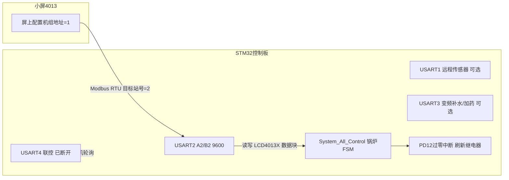
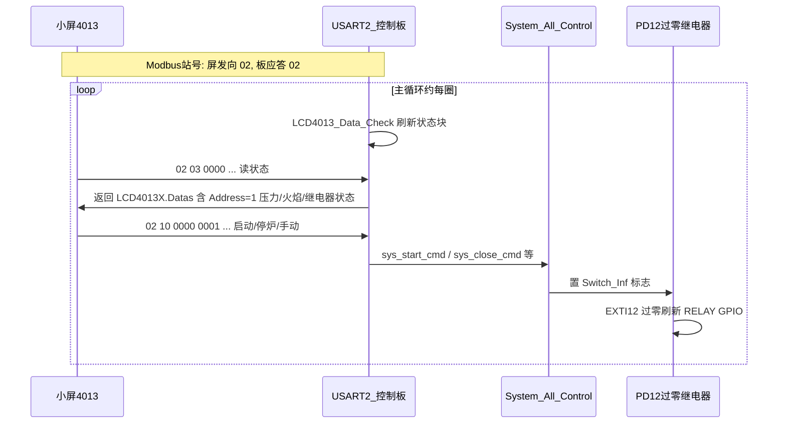

# 小屏单机链路说明（拨码 0 / 机组地址 1）

> 固件：MCGS 三拼/五拼 V2.1.0（`Soft_Version = 210`）  
> 文档日期：2026-07-02  
> 相关文档：[PD12_继电器过零刷新逻辑.md](PD12_继电器过零刷新逻辑.md)

## 1. 现场前提

| 现场条件 | 固件含义 |
|----------|----------|
| 只用一台分机控制板 | 最终应跑 **分机分支**（`Address_Number = 1~6`），执行 `System_All_Control()` |
| 没接联控 / UART4 断开 | **不走** UART4 主机轮询；`UnionControl_Flag` 通常为 0 |
| 拨码地址 = 0 | 上电 **不** 强制跳过小屏检测；会进入开机地址识别流程 |
| 小屏在屏上输入地址 = 1 | 对应 Flash 中的 `Sys_Admin.ModBus_Address = 1`（机组身份号） |
| 小屏 ↔ 控制板走 USART2 | 走 **4013 小屏协议**，不是 10.1 寸联控主屏协议 |

---

## 2. 物理链路



**关键点**：屏上显示的「地址 1」是 **机组编号**（`ModBus_Address`），但 Modbus 帧里的 **从站站号固定是 2**（见 `HARDWARE/USART2/usart2.c` 中 `LCD4013_Address = 2`）。小屏发 `02 03 ...` / `02 10 ...`，控制板以站号 2 应答。

---

## 3. 上电后角色判定

核心文件：`USER/main.c`、`SYSTEM/system_control/system_control.c` → `Power_ON_Begin_Check_Function()`

### 3.1 读拨码

```c
// USER/main.c
sys_flag.Address_Number = sys_flag.Address_1 * 1 + sys_flag.Address_2 * 2
                        + sys_flag.Address_3 * 4 + sys_flag.Address_4 * 8;
```

拨码 = 0 → `Address_Number = 0`（此时还 **不能** 认定就是主机）。

### 3.2 拨码为 0 时，必须等小屏

```c
// USER/main.c
if (sys_flag.Address_Number) {
    sys_flag.Check_Finsh = 0;              // 拨码 1~6：跳过小屏检测
    Sys_Admin.ModBus_Address = sys_flag.Address_Number;
}
while (sys_flag.Check_Finsh) {
    Power_ON_Begin_Check_Function();       // 拨码 0：在这里等小屏
}
```

**拨码 0 的意义**：不是「我就是主机」，而是「先尝试从小屏/Flash 确定机组号；检测不到小屏才当主机」。

### 3.3 开机检测（约 10 s 后）

`Power_ON_Begin_Check_Function()` 在 case 1 调用 `ModBus2LCD4013_Lcd7013_Communication()`：

- 监听 USART2 是否收到 **站号 = 2** 的合法 Modbus 帧
- 收到则 `sys_flag.Lcd4013_OnLive_Flag = OK`
- 若同时 Flash 里 `Sys_Admin.ModBus_Address != 0`（本场景为 **1**）：
  - `sys_flag.Address_Number = Sys_Admin.ModBus_Address` → **变为 1（分机）**
- 若检测不到小屏：
  - `Address_Number = 0` → 进入 **主机固件分支**（单机锅炉场景下通常 **不对**）

### 3.4 波特率

`Auto_Baudrate_check_Function()`：若已识别小屏（`Lcd4013_OnLive_Flag`），**固定 USART2 = 9600**，不做 115200 自适应。

代码依据：

```c
// SYSTEM/system_control/system_control.c
if (sys_flag.Lcd4013_OnLive_Flag) {
    return 0; // 小屏的波特率 9600
}

// USER/main.c
uart2_init(9600);
```

---

## 4. 运行时主循环

`USER/main.c` → `switch (sys_flag.Address_Number)`：

| 分支 | 条件 | 本场景 |
|------|------|--------|
| case 0 | 主机板 | **不应长期停留**（除非小屏没被识别） |
| case 1~6 | 分机 | **目标状态** |

分机分支每圈执行：

1. `LCD4013_Data_Check_Function()` — 把锅炉状态填入 `LCD4013X`，并把 `Address_Number` 同步为 `Sys_Admin.ModBus_Address`（=1）
2. `ModBus2LCD4013_Lcd7013_Communication()` — 处理小屏经 **USART2** 的读写
3. `Modbus3_*` — 本地 UART3 补水/加药（若接了）
4. `ModBus_Uart4_Local_Communication()` — UART4 本地解析（**未接线，基本空闲**）
5. **`System_All_Control()`** — 点火/运行/排污/补水 FSM
6. `Fan_Speed_Check_Function()` — 风机测速

**结论**：小屏是 **HMI + 命令下发**；锅炉逻辑在控制板本地 FSM；UART4 断开不影响单机运行。

---

## 5. USART2 通信协议

协议处理：`ModBus2LCD4013_Lcd7013_Communication()` → `LCD4013_MmodBus2_Communicastion()`



### 5.1 小屏 → 控制板（写命令，0x10）

| 寄存器 | 作用 |
|--------|------|
| 0x0000 | 启停 / 手动模式（0=停，1=启动，3=手动） |
| 0x0003 | 故障复位 |
| 0x0004 | 手动风机功率 |
| 0x000E~0x0012 | 点火功率、最大燃烧功率、炉温保护 |
| 0x0016 | 手动模式下继电器位图 |
| **0x0020** | **写机组地址 1~6** → 更新 `Sys_Admin.ModBus_Address` 并写 Flash |

### 5.2 控制板 → 小屏（读状态，0x03 @ 0x0000）

返回 `LCD4013X`（100 字节），其中包括：

- `Address` = 1（机组号，来自 Flash）
- `Device_State` / `Error_Code` / 压力 / 火焰 / 风机 / 水泵 / 排污状态等

### 5.3 站号与协议区分

| 项目 | 4013 小屏（本场景） | 10.1 寸联控主屏 |
|------|---------------------|-----------------|
| USART2 帧站号 | **固定 2** | **固定 1** |
| 处理函数 | `ModBus2LCD4013_Lcd7013_Communication` | `Union_ModBus2_Communication` |
| 控制板角色 | 分机，本地跑 FSM | 主机，聚合多从机 |
| 典型接线 | 小屏 A2/B2 ↔ 板 A2/B2 | 大屏 + UART4 多机联控 |

---

## 6. 「小屏当主控」在软件里的含义

| 说法 | 实际 |
|------|------|
| 小屏当主控 | 小屏是 **唯一人机界面**，经 USART2 下发启停/参数 |
| 屏地址 = 1 | **机组身份号** `ModBus_Address = 1`，不是 Modbus 帧站号 |
| 控制板拨码 = 0 | 允许上电识别小屏；识别成功后 **不是主机**，而是 **1 号分机** |
| UART4 断开 | 无联控主机；不会收到 UART4 轮询命令，`UnionControl_Flag` 保持 0 |

**不是**：控制板跑 `Union_ModBus2_Communication()` 去聚合多台从机（那是 case 0 + 10.1 寸主屏 + UART4 多机场景）。

---

## 7. 与 PD12 继电器刷新的关系

完整链路：

**小屏命令 → FSM → Switch_Inf 标志 → PD12 过零中断 → 继电器 GPIO**

- 小屏/FSM 只改 `Switch_Inf.*_flag`（如 `Send_Air_Open()`）
- `EXTI15_10_IRQHandler`（`EXTI_Line12`）在 PD12 过零点把标志同步到 RELAY GPIO
- 若过零中断丢失，主循环 `Relays_NoInterrupt_ON_OFF()` 降级强制刷新

详见 [PD12_继电器过零刷新逻辑.md](PD12_继电器过零刷新逻辑.md)。

---

## 8. 常见误区

1. **拨码 0 ≠ 控制板是主机**  
   只有「小屏检测失败」时才会 `Address_Number = 0` 进入主机分支；单机 + 小屏场景应识别为 **1 号分机**。

2. **屏上地址 1 ≠ Modbus 站号 1**  
   USART2 上 4013 协议 **固定站号 2**；站号 1 是 10.1 寸联控主屏协议（`Union_ModBus2`），与「小屏走串口2、串口4 断开」不是同一条链路。

3. **UART4 断开不影响单机**  
   分机模式下 UART4 主要用于联控主机下发；未接线时锅炉仍由 `System_All_Control()` + USART2 小屏命令驱动。

4. **若小屏未被识别**  
   会进入主机模式：跑 `Union_ModBus2`、**不跑** `System_All_Control()`，表现为「有通信但锅炉不工作」。需确认 USART2 接线、9600 波特率、小屏是否向 **站号 2** 发帧。

---

## 9. 现场验证清单

| 检查项 | 预期 | 方法 |
|--------|------|------|
| USART2 波特率 | 9600 | 示波器/串口助手；代码 `uart2_init(9600)` |
| Modbus 帧站号 | 小屏发 **02**，板应答 **02** | 抓包 A2/B2；不应出现 `01 03`（主屏协议） |
| 机组号 | `LCD4013X.DLCD.Address = 1` | 读 0x03 @ 0x0000 返回块偏移 66 处 |
| 拨码 | 0 | 串口1 调试：`地址参数= 0` |
| 识别后角色 | 分机 | 应跑 `System_All_Control()`，屏有实时压力/状态刷新 |
| Flash 地址 | `ModBus_Address = 1` | 小屏 0x0020 写入或出厂默认 |
| UART4 | 无数据 | 未接线时 `UnionControl_Flag = 0` |

### 9.1 代码侧已确认（静态验证）

以下项已在源码中核对，无需硬件即可确认设计意图：

| 项 | 文件 | 结论 |
|----|------|------|
| 4013 应答站号 = 2 | `HARDWARE/USART2/usart2.c` L1156 | `LCD4013_Address = 2` |
| 仅站号 2 触发 4013 解析 | `HARDWARE/USART2/usart2.c` L1498 | `if (Modbus_Address == 2)` |
| 小屏在线则固定 9600 | `SYSTEM/system_control/system_control.c` L4311 | `Lcd4013_OnLive_Flag` 时跳过 115200 自适应 |
| USART2 初始化 9600 | `USER/main.c` L81 | `uart2_init(9600)` |

---

## 10. 相关源文件索引

| 文件 | 内容 |
|------|------|
| `USER/main.c` | 拨码读取、开机检测循环、主循环 case 0/1~6 分支 |
| `SYSTEM/system_control/system_control.c` | `Power_ON_Begin_Check_Function`、`Auto_Baudrate_check_Function` |
| `HARDWARE/USART2/usart2.c` | 4013 小屏 / 10.1 寸主屏双协议 |
| `HARDWARE/USART2/usart2.h` | `LCD4013_Struct`、`Switch_Inf` 相关字段 |
| `HARDWARE/USART4/usart4.c` | 联控 UART4（本场景未使用） |
| `HARDWARE/relays/BSP_RELAYS.c` | `Switch_Inf` 标志设置 |
| `USER/stm32f10x_it.c` | PD12 过零继电器刷新 |
| `docs/PD12_继电器过零刷新逻辑.md` | 继电器过零中断详细说明 |
